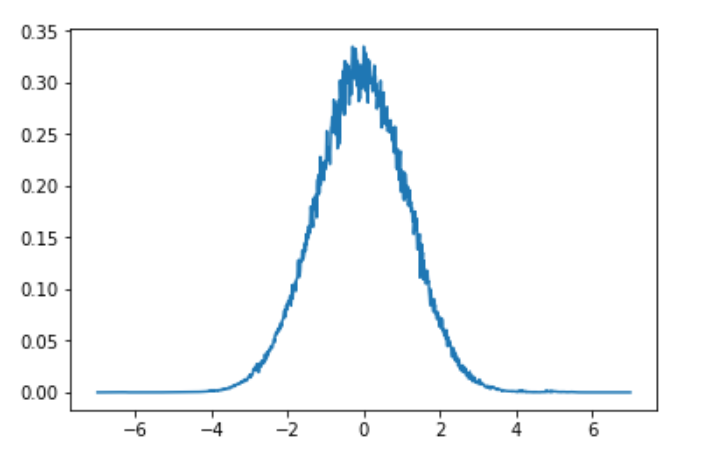

# Simple Generative Adversarial Network

This Jupyter Notebook focuses on creating Simple GAN using Keras-Neural Network library. 
Using GAN I create "faked" Gaussian Distributions from radom data




## Getting Started

To run it You need jupyter notebook installed.
The main file is SimpleGanInKeras.ipynb

### Prerequisites
```
-numpy
-keras
-tqdm
-matplotlb
```


## Authors

* [tugot17](https://github.com/tugot17)


## License

This project is licensed under the MIT License - see the [LICENSE.md](LICENSE.md) file for details


